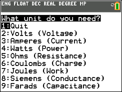

# TI BASIC Programs
Some (maybe?) useful tools I made in college for my own use.

These are just some applications I tossed together during my Electrical Engineering degree that I may have wanted to have on hand.

Ex: ELCUNITS program
