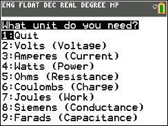

# TI BASIC Programs
Some (maybe?) useful tools I made in college for my own use.

These are just some applications I tossed together during my Electrical Engineering degree that I may have wanted to have on hand.

Ex: ELCUNITS program 

# Editing?
Use TI Connect CE to export the script to a calculator. 

If you need to convert the plaintext script, copy and paste it's contents into the app and export it as a new script.

# What do these do?

- ELCUNITS (Electrical Units)
    - A simple converter for various units in electrical engineering. It's not comprehensive, but it has most or all of what I needed or used.
- RESISTOR
    - Literally just a resistor color band program. Outputs ohms +- Tolerance % as a string. Also has failure rates if you scroll to the bottom of the first menu.
- TIMEELEC (Time Electrical)
    - A bunch of useful time-based maths for RC / RL circuits, and Time-Constants in-general.
    - (Im using the general formulas here, so you have to define the start / end current and voltage manually)
- RLCELEC (RLC Electrical)
    - Dedicated program for RL / RC / RLC circuits
- AMPS (Amplifiers)
    - Bunch of stuff related to Filtering and Amplifying signals